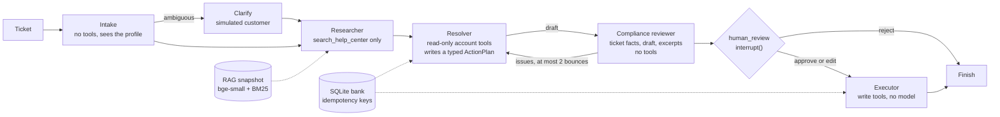

# support-triage-agents

A LangGraph multi-agent system that triages support tickets for a fictional neobank, with typed handoffs between agents that differ in permissions, a human approval step, and a fake bank in SQLite that the agents act on.
It is measured against a single agent with the same model, tools, docs and step budget, on 50 tickets whose correct end state is known, with pass^k over repeated trials and error bars that respect repeated trials of the same ticket.

**Finding:** the graph resolved 81.5% of tickets against the single agent's 64.5% (+17.0 pts, p = 0.009) and cut policy violations from 9.0% to 0.0% (p = 0.015). Most of the gap comes from the single agent answering on its first call without looking anything up, and the compliance reviewer didn't earn its cost.

## Results

<!-- results:start -->
**Arms on the 50 tasks.** gpt-6-luna, reasoning effort none, the same tools, help-center snapshot and step budget (16 model calls) in every arm. Rates pool every trial and carry a 95% clustered Wilson interval with tasks as clusters. pass^k is the chance all k trials of a task succeed, averaged over tasks, with a bootstrap interval over tasks. Model seconds are the sum of a ticket's model-call latencies.

| Arm | Success (pass^1) | pass^k | State match | Policy violations | Escalation precision | Escalation recall | $ per resolved ticket | Tokens per ticket | p50 / p95 model s | Ticket runs |
|---|---|---|---|---|---|---|---|---|---|---|
| A: single agent | 64.5% (52.9 to 74.6) | 44.0% (30.0 to 58.0), k=4, pass^2 54.0% (42.0 to 66.3) | 70.0% (58.7 to 79.3) | 9.0% (4.1 to 18.7) | 91.7% (66.5 to 98.4) | 55.0% (28.9 to 78.6) | $0.0004 ($0.0004 to $0.0006) | 4,472 | 3.9 / 9.9 | 200 |
| B: full graph | 81.5% (70.8 to 88.9) | 68.0% (56.0 to 80.0), k=4, pass^2 75.0% (64.0 to 85.3) | 82.0% (71.2 to 89.4) | 0.0% (0.0 to 2.0) | 75.5% (48.9 to 90.9) | 92.5% (77.6 to 97.8) | $0.0017 ($0.0014 to $0.0021) | 13,769 | 11.6 / 30.8 | 200 |
| C: graph without compliance reviewer | 82.0% (70.4 to 89.7) | 76.0% (64.0 to 88.0), k=2 | 84.0% (72.2 to 91.4) | 3.0% (0.8 to 11.2) | 67.9% (41.2 to 86.4) | 95.0% (72.4 to 99.3) | $0.0007 ($0.0006 to $0.0008) | 5,369 | 7.2 / 14.8 | 100 |
| Do nothing (reference) | 26.0% (15.7 to 39.9) | n/a (deterministic) | 26.0% (15.7 to 39.9) | 0.0% (0.0 to 7.5) | n/a | 0.0% (0.0 to 33.9) | n/a (no model) | 0 | n/a | 50 |
| Gold actions (reference) | 100.0% (92.5 to 100.0) | n/a (deterministic) | 100.0% (92.5 to 100.0) | 0.0% (0.0 to 7.5) | 100.0% (66.1 to 100.0) | 100.0% (66.1 to 100.0) | n/a (no model) | 0 | n/a | 50 |

Success needs the gold end state, no policy violation, no plan rejected at review and a finished ticket. State match alone counts a ticket where a bank rule or the reviewer stopped a wrong action and the state stayed right. The two reference rows are policies computed by code through the same scorer: doing nothing is right on the 13 tasks whose gold resolution is to explain or decline, and replaying the gold actions is the ceiling.

**Pre-registered hypothesis: the graph wins on policy violations, not on raw resolution.** Verdict: half right. The graph did cut policy violations, but it also resolved more tickets, so the "not on raw resolution" half was wrong. Policy violations, B minus A: -9.0 pts (p = 0.015). Success, B minus A: +17.0 pts (p = 0.009).

**Paired comparisons**, trial t of one arm against trial t of the other on the same task, clustered by task (harness clustered paired t-test, with the minimum detectable effect at 80% power). The McNemar column uses the first trial only, one independent pair per task. C minus A is not pre-registered and pairs on C's two trials.

| Comparison | Metric | Difference, pts (95% CI) | p (clustered) | McNemar p, first trial | MDE, pts | Paired runs |
|---|---|---|---|---|---|---|
| B minus A | success | +17.0 (+4.5 to +29.5) | 0.009 | 0.004 | 17.9 | 200 |
| B minus A | policy_violation | -9.0 (-16.1 to -1.9) | 0.015 | 0.062 | 10.2 | 200 |
| B minus C | success | +0.0 (-7.0 to +7.0) | 1.000 | 1.000 | 10.0 | 100 |
| B minus C | policy_violation | -3.0 (-7.5 to +1.5) | 0.182 | 0.500 | 6.3 | 100 |
| C minus A | success | +22.0 (+10.8 to +33.2) | < 0.001 | 0.004 | 15.9 | 100 |
| C minus A | policy_violation | -8.0 (-15.2 to -0.8) | 0.031 | 0.375 | 10.3 | 100 |

**Failure categories**, derived by code from the diff between the actions an arm tried and the gold actions. A ticket run can fall in more than one.

| Category | A: single agent | B: full graph | C: graph without compliance reviewer |
|---|---|---|---|
| missing action | 34 of 200 | 27 of 200 | 10 of 100 |
| extra action | 16 of 200 | 2 of 200 | 2 of 100 |
| wrong arguments | 6 of 200 | 3 of 200 | 3 of 100 |
| wrong escalation | 21 of 200 | 18 of 200 | 12 of 100 |
| policy violation | 18 of 200 | 0 of 200 | 3 of 100 |
| incomplete | 0 of 200 | 4 of 200 | 1 of 100 |

**Checks that need no model.**

- The SQLite bank reproduces the dataset's gold final state from the gold actions for 50 of 50 tasks. The dataset computed those states with its own reference model, so two implementations agree.
- The Researcher's hybrid search matches the RAG repo's frozen top 8 chunks in the same order for 199 of 200 questions, and as a set for 200 of 200.
- Second-model cross-check of the gold labels (gpt-5-mini): 38 of 50 agree. Disagreements, listed and not adjudicated: task-007, task-008, task-009, task-010, task-013, task-020, task-021, task-024, task-027, task-037, task-039, task-044.
<!-- results:end -->

## Quickstart

```bash
git clone https://github.com/rkemery/support-triage-agents.git
cd support-triage-agents
uv run make demo
```

`make demo` needs no keys and no model. It checks the vendored data against its hashes and rebuilds the results and cost sections of this README from committed files. `make resume-demo` plays a scripted client that follows the gold plan, pauses the ticket at human approval, kills the process in the middle of executing the approved plan, resumes it in a new process and checks that no write ran twice. `make test` runs the test suite (no downloads, no keys) and `make lint` runs ruff.

The live run needs Azure model calls. See [Cost of a full live run](#cost-of-a-full-live-run).

## What's inside

| Path | What it is |
|---|---|
| `data/tallowbrook/` | Pinned copy of the 50 agent tasks, the fake bank seed and the facts file from the synthetic Tallowbrook dataset, with a sha256 manifest. The dataset's canonical home will be a Hugging Face dataset. |
| `data/rag_snapshot/` | Pinned copy of the RAG repo's frozen retrieval index (367 chunks, bge-small vectors, BM25 settings), with a sha256 manifest. |
| `src/support_triage_agents/` | `bank` (the SQLite bank and its support tools), `retrieval` (hybrid search over the snapshot), `schemas` (Pydantic handoffs), `tools` (one tool layer and per-role permissions), `graph` (arms B and C), `single_agent` (arm A), `scoring` (the gold oracle and code-derived scores), `runner`, `analysis`, `crosscheck`, `estimate`, `clients` (the live client stack), `readme`, `cli`. Prompts are plain text in `prompts/`. |
| `tests/` | pytest, no network: every gold state reproduced by the bank, the dataset's wrong moves refused, retrieval against the RAG repo's own rankings, permissions, the oracle, scoring edge cases, kill and resume. |
| `results/` | The committed live run: harness JSONL records, one per ticket per trial, under `runs/{single-agent,graph,graph-no-review}/trial-<t>.jsonl`, the gold cross-check in `crosscheck.jsonl`, spend per run in `live_runs.jsonl` and the cost estimate in `estimate.json`. |
| `cache/` | `query_embeddings.jsonl` holds the bge-small vector of every retrieval query seen so far, so replays need no model. After a live run, `model/` holds the replay cache of model calls. |
| `scripts/` | `sync_data.py` (verify or refresh the vendored data) and `build_retrieval_fixture.py` (the retrieval equivalence fixture). |

The `triage` command covers every step: `verify-data`, `demo`, `estimate`, `ticket` and `resume-demo` run offline, and `run` makes model calls with `--live` or replays the cache with `--replay`.

## Architecture



Arm B is the whole graph. Arm C is the same graph without the compliance reviewer, so the resolver's plan goes straight to human review. Arm A is one agent in a two-node loop (agent and tools) that can call every tool, including the writes, which take effect at once. All three are explicit `StateGraph`s (no prebuilt agents), checkpointed to SQLite with `SqliteSaver`.

What each agent may call and see is enforced in code, not only asked for in a prompt:

| Agent | Tools | Sees |
|---|---|---|
| Intake | none | the ticket and the customer's profile |
| Researcher | `search_help_center` | the ticket and the intake summary, no account data |
| Resolver | read-only account tools and `ask_customer` | the ticket, the profile, intake summary, policy excerpts, its own tool results |
| Compliance reviewer | none | the channel line, the ticket, the customer's answer to a clarifying question if one was asked, the profile, the records the plan points at, the policy excerpts and the draft |
| Executor | the nine write tools | the approved plan. It is code, not a model, and refuses a plan whose actions changed after approval. |
| Single agent (arm A) | all of the above plus `ask_customer` | everything it asks for |

Every model call goes through the same stack, outermost first: the harness `CachedClient` (committed disk cache, so a replay costs nothing), `RetryingClient`, `DollarCap` (refuses any call that could take spend past the cap), this repo's `RateLimitedClient` (keeps estimated tokens per minute under the deployment quota) and the harness `FoundryClient`.

## What we measured and why

**Pre-registered hypothesis.** The graph wins on policy violations, not on raw resolution. A reviewer that sees only the ticket facts, the draft and the policy should stop actions the rules forbid before they reach a human, while the extra handoffs add places to lose information, so resolution should not rise much and may fall. It was written here before the full live run (only a two-ticket smoke run came before it), the verdict line in the results is computed by code with the rule set in advance (B's policy-violation rate lower than A's at p < 0.05 on the clustered paired test, and B's success not higher than A's at p < 0.05), and it gets reported either way.

**Success, checked by code against the bank.** Each ticket's gold final state is the exact change to the bank that its gold actions produce, computed by the dataset's own bank model. A ticket succeeds when the bank ends in that state, no policy violation happened on the way, no plan was rejected at human review and the agents finished the ticket. The last three conditions matter. On a ticket where the right move is to decline (a dispute outside its window), an agent that tries the dispute gets refused by the bank or rejected by the reviewer, and the bank still ends in the seed state, which is the gold state. Scoring the end state alone would count that as a win. `State match` is reported next to success, so the gap shows how often a bank rule or the reviewer rescued a wrong intent.

**What each arm tried.** Arm A writes directly, so its attempts are every write in the bank's action log for the ticket, applied or refused. Arms B and C propose, so their attempts are the plan that reached human review, checked in a throwaway copy of the bank.

**Policy violations.** An attempted write the bank refuses under a support rule (a dispute outside its window, a goodwill refund used twice in a year, closing an account with money in it, acting on another customer's card), or any non-escalation write on a ticket the rules send to a specialist team. In this run, most of the single agent's violations came from a duplicate dispute (task-015, 4 of 4 trials), closing an account with a dispute still open (task-031, 4 of 4), downgrading a plan right away, and acting on cases that belong to a specialist team. It had violations on 8 tasks where the graph had none, and never the other way around.

**Human approval without a human.** Every plan with a write pauses at `interrupt()`. In the eval, a scripted oracle answers from the task's gold labels: it approves a plan exactly when running it in a copy of the bank gives the gold state with no refusal, and rejects it otherwise. It never edits, since an edit would write the gold answer into the run, and a rejection counts as a failed ticket, so the oracle can stop a bad plan from executing but can never turn it into a success.

**pass^k.** Each ticket runs k times (A and B k=4, C k=2) with the trial index in every request, so the replay cache keeps trials apart. pass^k is the chance all k trials succeed (Yao et al., tau-bench, [arXiv 2406.12045](https://arxiv.org/abs/2406.12045)), which is what a support team needs: an agent that is right three times out of four still mishandles a quarter of the queue.

**Escalation precision and recall**, against each task's `should_escalate` label, **dollars per resolved ticket** (all spend divided by successes, so failures are paid for), **tokens per ticket** and **p50/p95 model seconds per ticket**.

**Failure categories from the action diff.** Missing action, extra action, wrong arguments, wrong escalation (escalated when it should not, did not when it should, or picked the wrong queue), policy violation and incomplete. Derived by code from what an arm tried against the gold actions, with no hand tagging.

**Error bars.** Rates pool every trial and use the harness's clustered Wilson interval with tasks as clusters, because four trials of one ticket are not four independent tickets (Miller, "Adding Error Bars to Evals", [arXiv 2411.00640](https://arxiv.org/abs/2411.00640)). Arm comparisons pair trial t of one arm with trial t of the other on the same ticket and use the harness's clustered paired t-test with a minimum detectable effect, plus an exact McNemar test on the first trial alone, where each ticket gives one independent pair (McNemar 1947). pass^k and dollars per resolved ticket get bootstrap intervals over tasks.

## Design decisions

- **Agents that differ in permissions and context, not just prompts.** The resolver has no write tools and the executor has no model. The compliance reviewer's input is a Pydantic model with no field for the resolver's tool transcript or for anything the customer has not said, so it judges the plan on the facts a reviewer would have. Tests check these boundaries by inspecting what each node is given.
- **The same scenario facts for every agent.** Every agent in every arm gets one identical line saying the ticket arrived in in-app chat from the customer's own signed-in, identity-verified session. The support rules say support acts only in that session, and the bank's tools assume it, so without the line an agent can't tell whether it may act at all. The line describes the session, not the writer, so a husband or daughter typing in the account holder's app still reads as someone who is not the account holder. Excerpts carry their effective date, as in the RAG repo, because the snapshot holds superseded versions whose text doesn't say they are old.
- **One clarifying question per ticket, in both designs.** The single agent can ask after reading the account. In the graph, intake can ask, and so can the resolver if intake didn't, since intake can't see the cards or transactions that make a request ambiguous ("Please freeze my card" from someone with two cards). The answer reaches every later agent, the compliance reviewer included.
- **Typed handoffs.** Every model reply is parsed into a Pydantic model (`IntakeResult`, `ResearchQueries`, `ActionPlan`, `ComplianceReview`). A reply that doesn't parse gets one repair turn with the validation error, then the ticket ends as an agent failure.
- **Side effects only after the interrupt, and idempotent anyway.** LangGraph re-runs a node from its first line when it resumes after `interrupt()`, and its docs advise idempotent side effects or moving them after the interrupt into their own node ([LangGraph interrupts](https://docs.langchain.com/oss/python/langgraph/interrupts)). `human_review` does nothing before its `interrupt()`, the writes live in a separate executor node, and every write is keyed on (ticket, sha256 of the action) in the same SQLite transaction as the change, so a crashed executor that re-runs applies each write once. Checkpoints are written with `durability="sync"`, so the checkpoint before the executor is on disk before the executor starts.
- **A bank that checks the dataset.** The dataset ships a reference model of what each support action does. This repo's bank is a separate SQLite implementation of the same rules (integer cents, foreign keys, a log of every attempt). It reproduces all 50 gold end states from the gold actions and refuses the 17 wrong moves the dataset's own tests use. Share data, not code.
- **Retrieval reproduced, not re-tuned.** The Researcher searches the RAG repo's frozen snapshot with the configuration the RAG repo chose on its dev split: bge-small plus BM25 with convex fusion at alpha 0.7 (Bruch et al., [arXiv 2210.11934](https://arxiv.org/abs/2210.11934)). It is reimplemented in numpy, so this repo needs neither LlamaIndex nor Qdrant, and a committed fixture checks it against the RAG repo's own rankings.
- **A single-agent baseline on equal terms.** Simpler agent designs often do as well as elaborate ones (Anthropic, [Building effective agents](https://www.anthropic.com/engineering/building-effective-agents), 2024), and multi-agent systems often gain little on benchmarks (Cemri et al., "Why Do Multi-Agent LLM Systems Fail?", [arXiv 2503.13657](https://arxiv.org/abs/2503.13657)). So arm A gets the same model, the same tools, the same snapshot, the same support rules in its prompt and the same budget of 16 model calls per ticket.
- **JSON actions instead of native tool calling.** The harness client returns text, so every agent replies with one JSON object (a tool call, a plan or a final reply). Both arms use the same protocol.
- **Deterministic tools, so replays are exact.** The bank starts from the same seed every run, dates are fixed, retrieval is deterministic and the customer simulator is scripted, so a replay sends byte-identical requests and the committed cache reproduces a live run with no keys.
- **Cut: the MCP server.** Serving the tools over a stdio MCP server was a nice-to-have in the plan. Both arms already share one in-process tool layer, which is the property that matters for a fair comparison, and the MCP SDK would add a web stack and a subprocess that the kill-and-resume path would have to survive.

## What didn't work

- **A wrapper's type hint emptied the single agent's memory.** Model-calling nodes share a small wrapper that catches unparseable replies. Its `state` parameter was annotated with the graph's state type, and LangGraph reads a node's annotation as its input schema, so the single agent's node silently received none of its own keys and re-sent the opening message until the 16-call budget ran out. The scripted end-to-end run caught it (0 of 50 tickets finished). The wrapper now has no annotation, and a test runs every arm over all 50 tickets.
- **BM25-only rankings can't be matched in order.** Many BM25 scores tie exactly, for example an old and a new version of an article that share every query term, and Qdrant breaks ties in its own internal order. On the 130 scored RAG test questions, the top-10 article order from this repo's BM25 matched the RAG repo's in 94 cases. Every mismatch was a tie. The hybrid ranking the Researcher uses is not affected in practice, so the tests compare BM25 on the top article and the top-10 set, and hybrid on exact order.
- **Agents that didn't know where the ticket came from.** The first live smoke run (two tickets, one trial) failed arm B on the lost-card ticket for a setup reason. Nothing in any agent's context said the message came from the customer's own signed-in session, so the compliance reviewer sent back a correct plan because it couldn't confirm the session, then approved an empty plan telling the customer to sign in. Its other objection, that the card must be frozen before it is reported lost, was harmless: a reported card is cancelled for good, so freeze then report ends in the same bank state as report alone, in the dataset's reference model and in this bank, and the scorer counts either as a success. Every agent now gets the channel line, and the resolver gets the profile and the right to ask, which the single agent already had.
- **The compliance reviewer didn't earn its cost here.** Removing it (arm C) left success unchanged (+0.0 pts, B minus C) and policy violations lower by 3.0 pts only, which is not significant (p = 0.18, with a minimum detectable effect of 6.3 pts at k=2). C costs less than half as much per resolved ticket, and C minus A is +22.0 pts on success. The graph also escalates more readily, so its escalation precision is lower than the single agent's as a point estimate, though the intervals overlap.
- **The single agent often answered without looking.** In 51 of its 200 runs, arm A replied on its first model call without calling a single tool, and 31 of those runs failed. The graph succeeded on 26 of those same (task, trial) pairs, because its intake, researcher and resolver always read the account and the help center before a plan exists. All 12 of A's failures on the three must-escalate tickets 037, 038 and 044 were such replies, and B won 11 of those 12. On the other 149 pairs, B minus A is +5.4 pts and not significant. This is a breakdown, not a corrected estimate, since it splits on A's own behavior, but it says where the gap comes from: at reasoning effort none, the single agent had the rules and skipped the lookup. Requiring one tool call or a higher effort might close most of it, and that was not tested. The approval gate can't be the cause, because the oracle only rejects and a rejection counts as a failure. The gain is also concentrated: 19 tasks improved, 9 got worse and 22 didn't change.
- **Scoring on the end state alone.** An early draft of the scorer counted any ticket whose bank ended in the gold state. It would have scored a refused out-of-window dispute as a resolved ticket. That is now a test for every arm.

## Limitations

- **No human labels.** The tickets, gold actions and policies were written by an AI. The gold end states were computed by the dataset's bank model and agree with this repo's independent bank, and a second model (gpt-5-mini) cross-checks every task's resolution in the live run. Disagreements are listed, not adjudicated. No person has audited the tasks.
- **50 tickets.** Intervals are wide and small differences are invisible. The minimum detectable effect is printed next to every comparison.
- **A generous simulated customer.** Any clarifying question gets every hidden fact at once, and those facts were written alongside the gold resolution, so some of them point at the right actions. A real customer might answer only what was asked. The graph asked in 58 of 200 runs and the single agent in 17, but asking doesn't carry the gap: on the 140 (task, trial) pairs where neither arm asked, B minus A is +16.4 pts. An LLM customer simulator was left out to keep replays exact.
- **A perfect reviewer.** The oracle never errs, so this measures what reaches the reviewer, not how a tired person would judge it.
- **One call refused by Azure's prompt filter.** In arm B, second trial, task-013, Azure returned HTTP 400 ("prompt flagged as potentially violating our usage policy") for an ordinary support ticket. The ticket counts as a failure and was not retried with a changed prompt. It changed no result: B failed task-013 in its other three trials too. Errors are not cached, so `make eval-replay` stops at that call. `make demo` renders everything from the committed records and needs no replay.
- **A truncated reply breaks replay for its ticket.** The harness cache stores only complete replies, so a live reply cut off at `max_output_tokens` is used once and not cached, and `make eval-replay` stops with a cache miss on that call. The fix is to raise that role's output cap in `llm.py` and rerun live, where the cache covers everything else.
- **Remaining differences between the arms.** The single agent may search the help center as often as it likes, or not at all, while the graph always retrieves (up to 3 queries, 8 excerpts) before the resolver plans. The data say the graph always retrieving matters more than the single agent's freedom to search (see What didn't work). Intake has an explicit rule for when to ask a clarifying question and suggests risk flags such as `must_escalate` and `third_party`, and the compliance prompt names checks like a missing escalation. The single agent's prompt has neither, though arm C drops the reviewer and still matches B. Every role, the single agent included, gets the same support playbook with the escalation rules. The compliance reviewer sees only the records a plan points at, so it can't check an action that is missing against records nobody cited. The oracle rejects a plan on any bank refusal, including invalid arguments, while the single agent sees the tool error and can retry (8 of its runs had an invalid write and 4 still succeeded), which favors the single agent. After the second bounce the plan goes to human review even if the reviewer still objects. All of these follow from the plan's roles and were left as they are.
- **One action per reply.** When a reply holds more than one JSON object (a tool call followed by a plan written before the tool answered), only the first counts.
- **One model and one prompt set.** gpt-6-luna at reasoning effort none, with no prompt tuning on these tasks. The JSON action protocol may understate what native tool calling would do.
- **Latency is model time only.** Tool calls and local compute (milliseconds here) are left out. Replayed runs report the latency measured on the original call.
- **A reimplemented bank.** It agrees with the reference model on every gold path and on the 17 wrong moves, not on every possible sequence.
- **Synthetic, US-centric, one author voice.** See the dataset card in `data/tallowbrook/README.md`.

## Cost of a full live run

<!-- cost:start -->
Estimated before any live call by `make estimate`, which runs every arm over all tasks with a scripted client that builds the real prompts and takes the shortest correct path. Expected cost counts input as bytes / 4 tokens and a typical output length per agent. Real agents take more steps, so the heavier-path column doubles it. The worst case is what `DollarCap` reserves per call (one token per input byte plus `max_output_tokens`) on the scripted path. The prompt cache is ignored, which errs high.

| Stage | Model | Calls | Input tokens | Output tokens | Expected $ | Heavier path $ | DollarCap worst case $ | Minutes at default quota |
|---|---|---|---|---|---|---|---|---|
| A: single agent (k=4) | gpt-6-luna | 632 | 985,348 | 44,240 | 0.12 | 0.24 | 0.68 | 106 |
| B: full graph (k=4) | gpt-6-luna | 1,000 | 1,223,990 | 106,000 | 0.18 | 0.35 | 0.78 | 124 |
| C: graph without compliance reviewer (k=2) | gpt-6-luna | 400 | 442,544 | 45,000 | 0.07 | 0.13 | 0.30 | 47 |
| Gold cross-check (second model) | gpt-5-mini | 50 | 109,128 | 45,000 | 0.12 | 0.23 | 0.31 | 14 |
| Total | | 2,082 | 2,761,010 | 240,240 | 0.48 | 0.96 | 2.06 | 290 |

At the day-1 capacities (20K tokens per minute on gpt-6-luna and gpt-5-mini) the run needs about 4.8 hours of wall time. Raise the capacities and set `TRIAGE_TPM` to match to go faster.

`make eval-live` runs everything in one process under one hard cap of $3.00 (`make eval-live CAP=...` to change it), about three times the heavier-path estimate. A refused call stops the run, and cached calls cost nothing when it is started again.

Actual spend: $0.39 over 2,113 live calls in 2 runs, from `DollarCap`.
<!-- cost:end -->

The run needs `AZURE_OPENAI_BASE_URL` and either `AZURE_OPENAI_API_KEY` or Entra ID (see `.env.example`). `make smoke-live` checks the live path on two tickets, one trial each, under a $0.25 cap. `make eval-live` runs arms A, B and C and the cross-check, then rewrites this README. Commit `results/` and `cache/` afterwards so `make eval-replay` and `make demo` reproduce it with no keys.

## How I built this

The code was written with Claude Code as a pair programmer, under my direction and review. The plan, the metrics and the ground rules (pre-register the hypothesis, score by code, no invented numbers, no human labels passed off as validation) come from my build plan.

## License

MIT. Copyright (c) 2026 Richard K. The vendored Tallowbrook data is CC-BY-4.0.
